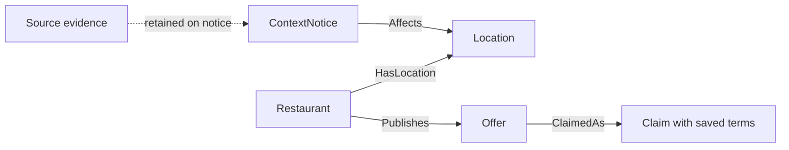

# Free local data for M-Local

Reviewed September 26, 2026. This is a source and product decision guide, not an
implemented integration. Direct request results are in [source-checks.json](source-checks.json).
Use the companion [impact brief](LOCAL-IMPACT-EVIDENCE.md) for the team pitch.

## Recommendation

Finish the existing access-notice feature first. Use public academic dates to
inform merchant conversations and the demo narrative. After the required flow
passes, choose **one** additional feature, with curated campus timing ahead of an
event-feed adapter. Keep transit, weather and amenities as later options.

The product should answer: **Is this offer useful to me, valid at this time, and
practical to reach?** More records alone do not answer that question. Merchants
supply actual menus, prices, stock, eligibility and promotions. Public information
adds context; it cannot establish merchant participation or authorize a discount.

The four-engineer ownership and acceptance criteria remain in
[TEAM-CONTRACT](../TEAM-CONTRACT.md). This research does not expand all four missions.

## Sources ranked by usefulness

P0 means part of the current build or pitch; P1 means a candidate after core checks;
P2 means defer. Refresh intervals below are our proposals, unless called out as a
publisher requirement. Free access and permission to redistribute are separate.

| Source | Useful contribution | Access and evidence | Reuse / freshness / limitation |
|---|---|---|---|
| **P0: [Ann Arbor road and lane closures](https://www.a2gov.org/engineering/traffic/road-and-lane-closures/)** | Explain access disruption beside an offer | Public HTML, direct HTTP 200. Start with a human-reviewed normalized record; no stable closure API verified | Attribution and factual summary with source link; blanket content license unverified. Recheck daily and before demo; preserve the 24-hour contract. Vehicle closure does not establish a blocked storefront or pedestrian entrance |
| **P0 research; P1 feature: [U-M academic calendar](https://ro.umich.edu/calendars)** | Merchant-approved study-period offers and break-aware timing | Public page and [2026-27 PDF](https://ro.umich.edu/sites/default/files/calendar/pdfs/Cal_2026-2027.pdf), read successfully through research browser. Curate a few dated facts | Ann Arbor campus calendar; some schools differ. Proposed weekly review and before a campaign. General campus timing is not an individual's exam schedule. Full-document reuse terms unverified |
| **P1: [Happening @ Michigan feeds](https://events.umich.edu/feeds)** | Nearby public events, including music, as context for a meal | Documented JSON, CSV, iCal and RSS. **Direct JSON request returned HTTP 403**; no working local adapter proved | Feed reuse for event listings encouraged. Link to event; cache and refresh, proposed hourly for the selected window. Listings do not prove attendance; missing cost is unknown, not free |
| **P2: [TheRide developer data](https://www.theride.org/business/software-developers)** | Scheduled routes/stops near a confirmed location | Public [GTFS ZIP](https://www.theride.org/sites/default/files/google/google_transit.zip) downloaded and parsed. Feed version S1000302; declared coverage Aug 23, 2026-Jan 30, 2027 | Free schedule use; publisher requires updates within three business days of a new file. No logo/trademark grant. Live API access requires contacting TheRide, which we have not done. GTFS is scheduled service, not live arrivals |
| **P2: [National Weather Service API](https://www.weather.gov/documentation/services-web-api)** | Explain weather context for a merchant-approved indoor/takeout offer | Public `/points` request returned HTTP 200 and forecast links. Forecast payload itself not tested in this pass. No paid account used | Documentation permits free use for any purpose; identifying User-Agent required and rate limits apply. Follow cache headers and retain issue/valid times. Forecasts are uncertain, and cannot justify a precise sheltered walking route |
| **P2: [City open-data catalog](https://data.a2gov.org/)** | Candidate park amenities, public seating and other place context | [Park Amenities metadata](https://ckan.a2gov.org/api/3/action/package_show?id=40f63488-56b8-4afc-8b9d-7aad1010de1f) returned HTTP 200 with four resources | Metadata explicitly says **License not specified**. Do not treat the whole catalog as freely redistributable. Resolve dataset terms before importing; review version monthly. An amenity record does not prove present availability, hours or accessibility |
| **P0 pitch: [Ann Arbor DDA reports](https://www.a2dda.org/about-downtown/downtown-reports/)** | Downtown business and activity context for problem framing | Public 2025 report read; see dated evidence in companion brief | Annual, historical, downtown district rather than whole city. Public report access is not a license to redistribute its underlying commercial datasets |
| **P0 pitch: [U-M estimated student costs](https://finaid.umich.edu/getting-started/estimating-costs)** | Ground the affordability rationale in a published student budget | Current 2026-27 cost page read | Institutional planning estimates, not each student's spending. Retain academic year and cost category; refresh annually. No bulk content license verified |
| **P0 pitch: [Census QuickFacts: Ann Arbor](https://www.census.gov/quickfacts/annarborcitymichigan)** | City scale and household context | Public table read; Census API access not tested | Keep geography, reference period and estimate vintage attached. City data is not a student subgroup and cannot infer an individual's budget or preferences |

## Endpoint notes for Engineer 3

These are public research requests, not application routes. Issue requests from the
server, cache appropriate results, and avoid a fetch for every offer card. The
reviewed JSON adapter remains enough for the required demo.

```text
City reviewed source:
https://www.a2gov.org/engineering/traffic/road-and-lane-closures/

Documented U-M JSON request, blocked with 403 in this environment:
https://events.umich.edu/list/json?v=2&max-results=5&filter=all&range=2026-09-26to2026-09-27

TheRide static schedule:
https://www.theride.org/sites/default/files/google/google_transit.zip

NWS point lookup using an illustrative Ann Arbor city-center point, not user GPS:
https://api.weather.gov/points/42.2808,-83.7430
Returned forecast URL (not fetched in this pass):
https://api.weather.gov/gridpoints/DTX/42,30/forecast
```

Do not build around bypassing the U-M 403. A documented endpoint can still fail
from a particular environment. Keep a link-only or explicitly reviewed snapshot
fallback; test access again when an adapter is actually selected.

For events, retain only occurrence ID, title, start/end, timezone, venue, optional
cost, permalink and modification time. Avoid copying descriptions, images,
contacts or livestream credentials. Treat source text as untrusted content and
render as text. Keep recurring event occurrences distinct; deduplicate by source
and occurrence ID. Unknown end time cannot support an exact post-event offer.

Before any transit feature, handle `calendar_dates.txt` exceptions, agency timezone
and service-day times beyond midnight, and show service date plus retrieval time.
The inspected `calendar.txt` has three services spanning Sep 12-Jan 30, while
`feed_info.txt` declares the broader coverage above. Neither proves that any
particular trip runs on a selected date. Link users to official disruption updates.

## Make the graph earn its place

The current, bounded Jac relationship is:



Only add an `Affects` relationship after the location association is reviewed.
Street-name similarity or physical proximity alone is insufficient. Preserve a
source ID, external ID, revision, checked time, validity and original source link.
The public source record stays separate from a fixture that simulates a fictional
shop. Do not import the research example as a verified notice on a demo business.

Jac should perform the domain work: idempotent graph updates, time/freshness
checks, location-specific retrieval, and deterministic explanations. A source
adapter can normalize data, but should not become a separate Python application
that owns the product rules. No LLM is needed to establish whether a dated notice
is current. An optional model may propose merchant wording from structured facts;
the merchant must approve any offer and the model cannot create factual links.

Future event or campus-calendar relationships require a separately agreed schema.
Do not overload an access notice with weather, schedules and campaign targeting.
An eventual nearby-event explanation should state the measured relationship and
its limit, for example distance from a confirmed venue, without claiming attendance
or walking time. A map is one view of the evidence, not evidence by itself.

## Data behavior to preserve

- On refresh failure, keep the last good record and its original checked time.
  A failed attempt must not make stale information look current.
- Distinguish source publication, retrieval, review and effective times. Use
  timezone-aware values; dates without a reliable end need review, not a made-up end.
- No known notice means unknown access, not an all-clear. Do not hide a business
  merely because a surrounding street has construction.
- Expire advice and invalidate old explanations when evidence changes. Cached
  reading may be useful later; claiming and redemption still require the server.
- No student tracking is required for campus-wide timing. Start with voluntary
  budget/preferences and selected area; do not infer sensitive traits from places.
- Public evidence does not validate menus, food allergens, business participation
  or merchant-authored savings claims. Keep those authorities distinguishable.

## Handoff to the four owners

1. **Engineer 3:** use the City source for research, maintain the implementation
   ledger in `docs/data/SOURCES.md`, and build one simulated, source-labeled access
   scenario under the existing contract. Include stale/failed-refresh behavior.
2. **Engineer 2:** consume the agreed access DTO without changing claim terms or
   eligibility based on outside data.
3. **Engineer 4:** show relevance, source, checked time and current/needs-recheck
   state beside the offer. Keep the source link available on a phone.
4. **Engineer 1:** prove the merged behavior and record the research-versus-live
   distinction in the demo. Use the impact brief's evidence with its limitations.

The next product decision is whether campus timing deserves the one optional
extension after acceptance checks. The immediate engineering task stays unchanged.
